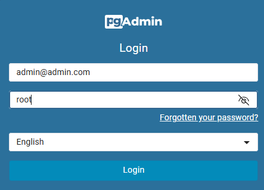
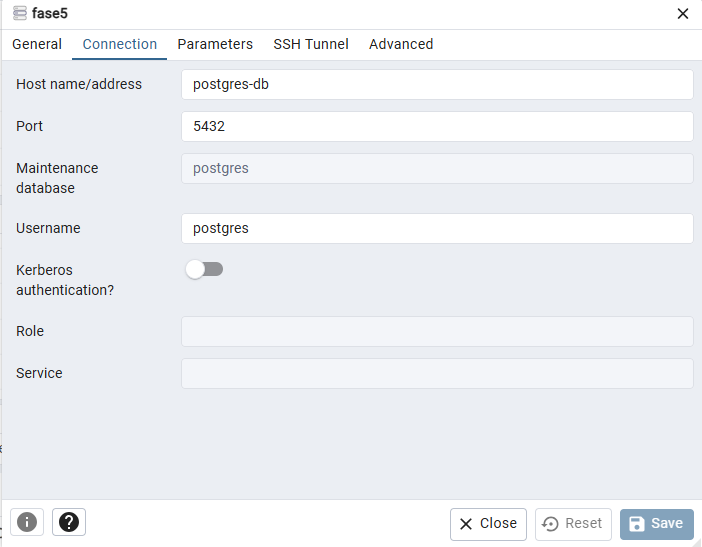

# Hackaton

<hr>
Todos os micros serviços foram desenvolvidos utlizando a versão <b>21 do Java - AmazonCorretto.</b>


[](https://skillicons.dev)


## 📑 Swagger Documentação
- Microserviço de Clientes - http://localhost:8080/api/cliente/swagger-ui.html
- Microserviço de Cartões - http://localhost:8080/api/cartao/swagger-ui.html
- Microserviço de Pagamentos - http://localhost:8080/api/pagamentos/swagger-ui.html


## Serviços em nossa aplicação
- [x] PostgreSql
- [x] Pgadmin
- [x] Service-Discovery
- [x] Service-Gateway
- [x] Service-Autenticacao
- [x] Service-Cliente
- [x] Service-Cartao
- [x] Service-Pagamento

<hr>

## PostgreSql
Utilizamos a última imagem do Postgre em container para que seja possível efetuar a persistencia de dados dos microserviços utilizados nesse projeto.<br>
Para simular um banco de dados para cada serviço, utilizamos a criação de <strong>Schemas</strong> para dividir o banco de dados.<br>
### Schemas
- dbClientes
- dbcartoes
- dbPagamentos

## 💻 Configuração Pgadmin
- pgadmin: http://localhost:15432/<br>
  
  <br><strong>Configuração do servidor</strong>
  <br>Host name/address: postgres-db
  <br>Username: postgres
  <br>Password: Postgres2024!
  

<hr>

## 🔧 Instalação

```shell
git clone https://github.com/peresricardo/Hackaton.git
```
### Docker

#### Limpar, compilar e gerar imagem para o docker

Na raiz do projeto existe um arquivo chamado buildAll.bat, executando esse arquivo ele irá
fazer o build, gerar a imagem docker automaticamente de todos os serviços.

Para executar o arquivo buildAll.bat execute um prompt de command "cmd"
vá para a pasta onde baixou o projeto e execute o comando:
```sh
buildAll
```

Para executar os serviços de uma única vez execute o docker compose,
vá para pasta do projeto e execute o comando:
```sh
docker-compose up -d
```


## 🧪 Execução de testes no projeto
<hr>

- Para executar os testes unitários:

```sh
mvn test
mvn clean jacoco:prepare-agent install jacoco:report
```
- Para executar os testes integrados:
```sh
mvn test -P integration-test
```